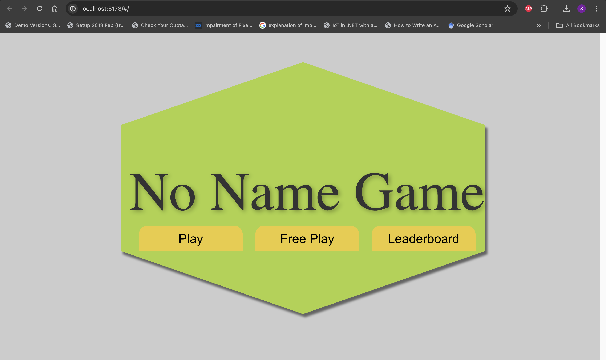
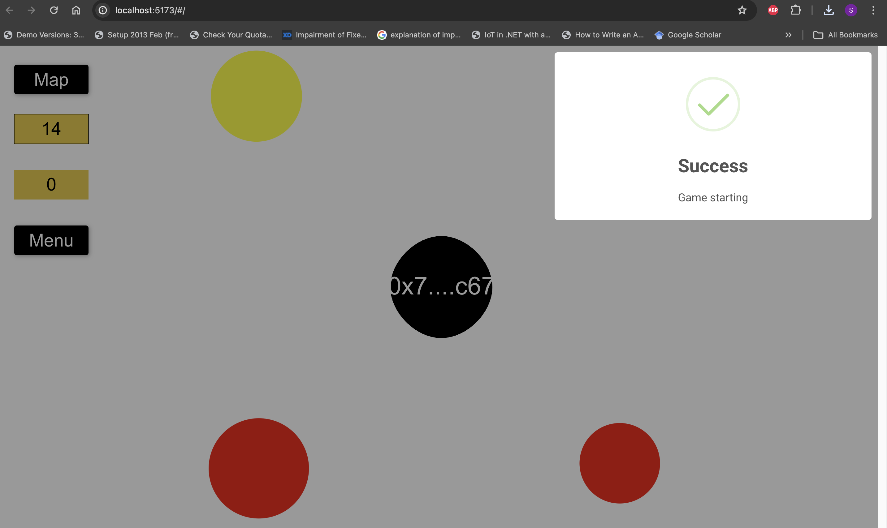
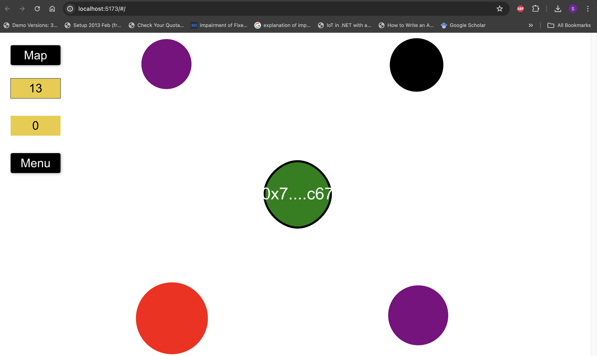
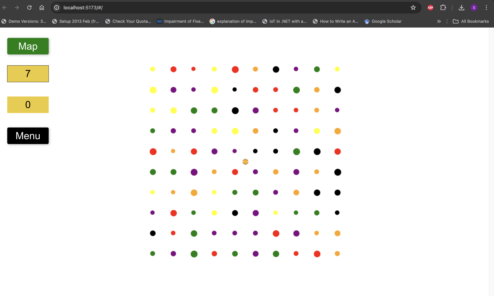
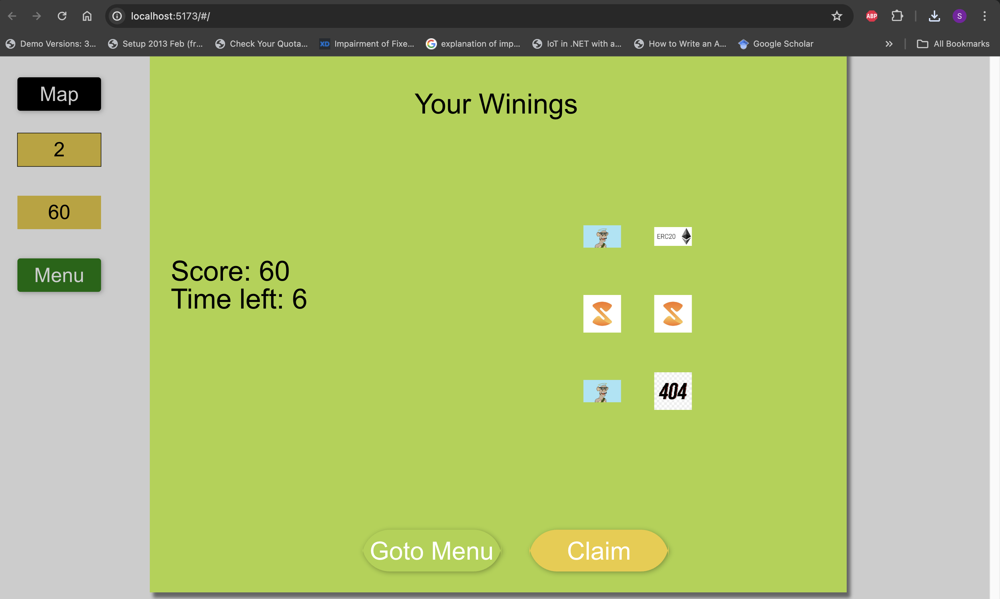
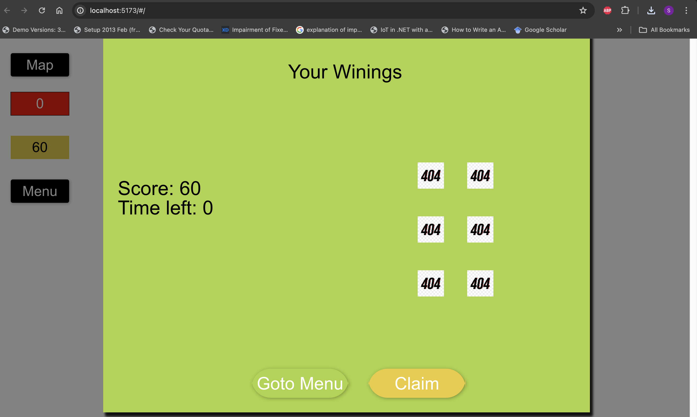

# No Name Game  

This is a Proof of Concept (POC) Game that interacts with Cairo contracts for distributing in game rewards and keeping track of player scores.

## Badges  
  

## Rewards

With each play session, a player is given a specified time (e.g., three minutes) to move around the map collecting items that match their color. Collecting non-matching items decreases their size and remaining time, while matching items reward extra time and possibly one of the following:
- NFT
- Token

### Blacklisting or Whitelisting
Players can be blacklisted or whitelisted by the admin based on defined criteria.

## Screenshots  

1. 
2. 
3. 
4. 
5. 
6. 

## Tech Stack  

 
 
  
     
 
 

## Run Locally  
See Packages folder for individual project instructions. For contract see make file
## Acknowledgements  

- [Awesome Readme Templates](https://awesomeopensource.com/project/elangosundar/awesome-README-templates)
- [Awesome README](https://github.com/matiassingers/awesome-readme)
- [How to Write a Good README](https://bulldogjob.com/news/449-how-to-write-a-good-readme-for-your-github-project)

## Feedback  

If you have any feedback, please create an issue and tag me.

